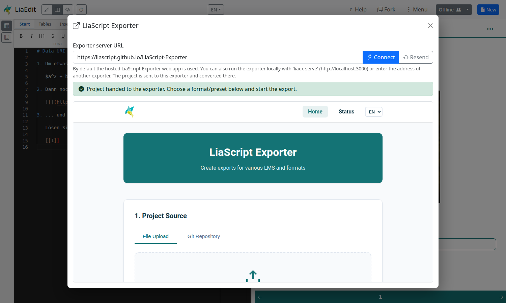

<!--
author:   Sebastian Zug, André Dietrich, Anja Hawlitschek und Anja Schulz

email:    sebastian.zug@informatik.tu-freiberg.de

version:  0.1.0

language: de

narrator: Deutsch Male

mode:     Presentation

date:     02/10/2026

comment:  Phase 6 des Workshops "Lehre aktivierend gestalten mit LiaScript" (02.10.2026).
          Verbreiten und Disseminierung eigener Kurse - 35 Minuten.

repository: https://github.com/anja-schulz-dhs/LiaWorkshop_HDS-eSALSA

attribute: Lehre aktivierend gestalten mit LiaScript
           von Sebastian Zug, André Dietrich,
           Anja Hawlitschek und Anja Schulz
           ist lizenziert unter [CC BY-SA 4.0](https://creativecommons.org/licenses/by-sa/4.0/)

link:     ../style.css

-->

# Verbreiten von LiaScript-Kursen

> <h2>Phase 6 des Workshops "Lehre aktivierend gestalten mit LiaScript"</h2>
>
> 

>
> <h4>Prof. Dr. Sebastian Zug, TU Bergakademie Freiberg</h4>
> <h4>Dr. Anja Hawlitschek, Otto-von-Guericke-Universität Magdeburg</h4>
> <h4>Dr. Anja Schulz, Hochschuldidaktik Sachsen</h4>
>
> <h4>02.10.2026</h4>

--------------------------------------------

## Worum geht es in diesen 35 Minuten?

Sie haben in Phase 3 ("Anwenden") Ihren eigenen Kurs gebaut — jetzt geht es darum, ihn aus dem LiveEditor herauszubekommen und mit anderen zu teilen. Konkret klären wir:

- Wie kommt Ihr Kurs aus dem LiveEditor zu einer Kollegin in einem anderen Haus?
- Welcher Weg passt zu welchem Szenario — schnelle Vorschau, vollständiger Kurs, LMS-Integration?
- Was bleibt von den 5V-Freiheiten in jedem Verbreitungsweg erhalten?

| Zeit   | Was passiert?                                                     |
| ------ | ----------------------------------------------------------------- |
| 15 min | Überblick: fünf Verbreitungswege                                  |
| 15 min | **Sie erkunden selbst** einen Weg mit Ihrem eigenen Material      |
| 5 min  | Kurzer Austausch: Was hat funktioniert, wo hakt es?               |

## Fünf Verbreitungswege im Überblick

In [Phase 2](https://liascript.github.io/course/?https://raw.githubusercontent.com/anja-schulz-dhs/LiaWorkshop_HDS-eSALSA/refs/heads/main/02_Verstehen_20261002.md#1) haben wir festgehalten: Ein LiaScript-Kurs ist eine einzelne Markdown-Datei, die im Browser ausgeführt wird. Diese Eigenschaft eröffnet fünf sehr unterschiedliche Verbreitungswege — von der niedrigschwelligen URL bis zum gemeinsam gepflegten Git-Repository.

| Weg                 | Was wird geteilt?              | Wofür geeignet?                                          |
| ------------------- | ------------------------------ | -------------------------------------------------------- |
| **Data-URI**        | Ein Link, der den Kurs enthält | Schnelle Vorschau, kurze Materialien, Versand per Mail   |
| **ZIP-Export**      | Alle Dateien als Archiv        | Vollständige Kurse mit Bildern, lokale Nutzung           |
| **Einbettung in OPAL** | Markdown-Datei oder ZIP-Archiv | Schnelle Integration in OPAL — ohne Lernstand            |
| **SCORM-Paket**     | LMS-fähiges Lernpaket          | Integration in Moodle, OPAL, ILIAS — inkl. Lernstand     |
| **Git-Repository**  | Quelle auf GitHub/GitLab       | Kollaborative Entwicklung, Versionierung, dauerhafter Link |

## 1. Verbreitung per Data-URI

> [!TIP]
> **Definition** Eine Data-URI ist ein Link, der den vollständigen Kursinhalt direkt in der URL transportiert — keine zusätzliche Datei, kein Server, kein Hosting nötig.

Rufen Sie im LiveEditor rechts oben `Menu` auf und wählen Sie im Reiter `Publish` die Kachel `data-URI`. Diese URL können Sie per E-Mail, Chat oder QR-Code weitergeben — beim Öffnen erscheint der vollständige Kurs im LiaScript-Player.

https://liascript.github.io/course/?data:text/plain;charset=utf-8;Content-Encoding=gzip;base64,H4sIAAAAAAAAAy2Pu26DQBBF+/2KG8dFoojlYdFEcoMiS5bc5EGFsLzAwG4Ca7S7CMsfliqdfyyA3MxDc2bm3ke8CSeQfuwhOiSkbK+oZSzkSDuQG4XFXkvROlwHSFGQRn37a6Y0KgNSmrA7m47auWYMwFocI7ygmOIW5TFaMxbx6Y3W0OdSzhwS1VYL/JDlT9K53r76vhu82pAqyDS8It8qR9avqBZD6/xatVMXBVHsBbGfTMxI5ifk332D1YGk8TDoatZiSznoxhZ3BBUZfKXY3U+vnsHYhoNzvmzMct4HdV3kHG6/drL2qQin+OLF2+A02zW48GWeZWGe/wMaYkYqNAEAAA== 

> [!NOTE]
> **Worauf Sie achten sollten:** Data-URIs werden mit zunehmender Kurslänge sehr lang. Für kurze Materialien (wenige Seiten Text, keine eingebetteten Bilder) ein eleganter Weg — für umfangreichere Kurse stoßen Sie an die URL-Längen­grenzen mancher Mailprogramme und Browser.

## 2. Verbreitung per ZIP-Datei

Im LiaLiveEditor können Sie Ihren Kurs als ZIP-Datei exportieren. Diese Archivdatei enthält alle notwendigen Dateien: die Markdown-Quelle, eingebettete Bilder, lokal referenzierte Ressourcen. Die ZIP-Datei können Sie dann beliebig verbreiten — per Mail, über einen Cloudspeicher, in einem Repositorium.

> [!IMPORTANT]
> **So öffnen die Empfängerinnen und Empfänger das ZIP:** Importieren Sie die ZIP-Datei im Interpreter. Den Import-Dialog öffnen Sie unter https://liascript.github.io/course/.

> [!IMPORTANT]
> **Der entscheidende Vorteil:** Empfängerinnen und Empfänger erhalten die *Quelle* — also den vollen Markdown-Text. Damit greifen alle fünf V-Freiheiten aus [Phase 2](https://liascript.github.io/course/?https://raw.githubusercontent.com/anja-schulz-dhs/LiaWorkshop_HDS-eSALSA/refs/heads/main/02_Verstehen_20261002.md#1) auf: verwahren, verwenden, verarbeiten, vermischen, verbreiten.

## 3. Unmittelbare Einbettung von LiaScript in OPAL

Seit 2025 wird LiaScript neben der SCORM-Integration in OPAL nativ unterstützt. Das heißt: Sie laden Ihren Kurs aus dem LiveEditor herunter und direkt im OPAL-Kursbaustein **„Einzelne Seite“** hoch — ohne den Umweg über einen SCORM-Export (Abschnitt 4).

Je nach Kurs haben Sie zwei Möglichkeiten:

| Upload                    | Im LiveEditor                       | Wann?                                                                                   |
| ------------------------- | ----------------------------------- | --------------------------------------------------------------------------------------- |
| **Einzelne Markdown-Datei** | `Menu` → `Export` → `README.md`     | Ihr Kurs besteht nur aus Text; Bilder und Videos sind über Web-Adressen eingebunden.    |
| **ZIP-Archiv**            | `Menu` → `Export` → `ZIP archive`   | Sie haben eigene Bilder, Audios oder weitere Dateien in den LiveEditor hochgeladen.     |

[Anleitung für die Einbettung von LiaScript-Kursen in OPAL](https://bildungsportal.sachsen.de/opal/auth/RepositoryEntry/28960423936/CourseNode/1751769302969809009?1) · [Blogbeitrag der TU Chemnitz](https://blog.hrz.tu-chemnitz.de/urzcommunity/2025/07/08/neu-im-opal-mit-liascript-schnell-zum-anschaulichen-interaktiven-kurs/)

> [!IMPORTANT]
> In dieser Situation sind aber keine Lernstandsdaten verfügbar.

## 4. Export mit dem LiaScript Exporter

Mit dem [LiaScript Exporter](https://liascript.github.io/LiaScript-Exporter/) können Sie Ihren Kurs als **SCORM-Paket** exportieren. Dieses Paket lässt sich in jedes LMS hochladen, das SCORM unterstützt — also in Moodle, OPAL, ILIAS und vergleichbare Systeme.

Der Exporter läuft als **WebApp direkt im Browser** — keine Installation nötig. Am einfachsten starten Sie ihn aus dem LiveEditor: `Menu` → Reiter `Export` → `LiaScript Exporter`. Ihr Kurs wird dabei direkt übergeben — Sie müssen nur noch das Zielformat wählen.

Ohne LiveEditor, z. B. für einen Kurs aus einem Git-Repository:

1. Öffnen Sie https://liascript.github.io/LiaScript-Exporter/
2. Laden Sie Ihren Kurs: die **ZIP-Datei aus dem LiveEditor** (siehe Abschnitt 2) per Drag & Drop — oder die URL Ihres Git-Repositorys.
3. Wählen Sie das Zielformat und laden Sie das Ergebnis herunter.

| Zielformat                           | Wofür?                                                   |
| ------------------------------------ | -------------------------------------------------------- |
| **SCORM 1.2 / SCORM 2004**, **IMS**  | Lernpaket für Moodle, OPAL, ILIAS — inkl. Lernstand      |
| **xAPI**                             | Lernstand an einen Learning Record Store senden          |
| **PDF**, **EPUB**, **DOCX**          | Handout, E-Book oder Word-Dokument zum Weiterbearbeiten  |
| **Web**                              | Eigenständige Webseite, z. B. für den eigenen Webserver  |
| **Android**                          | Kurs als App                                             |
| **JSON**, **RDF**                    | Metadaten, z. B. für OER-Repositorien                    |

> Für Fortgeschrittene gibt es den Exporter auch als Desktop-Anwendung und als Kommandozeilenwerkzeug — etwa um bei jeder Änderung im Git-Repository automatisch neue Pakete zu erzeugen.

> [!NOTE]
> **Warum das wichtig ist:** SCORM ist der Standard, mit dem Lernmanagementsysteme Inhalte einlesen *und gleichzeitig Lernstand erfassen* — also etwa, ob ein Quiz bearbeitet wurde, welche Antworten gegeben wurden, ob ein Kurs als „abgeschlossen" gilt. Genau diese Anbindung an die LMS-Verwaltung bekommt Ihr LiaScript-Kurs mit dem SCORM-Export — ohne dass der Inhalt seine Markdown-Quelle verliert.

> [!TIP]
> In einem Nextcloud-Ordner der OVGU finden Sie bereits ein fertiges SCORM-Paket unseres Selbstlernkurses zum Download. Damit können Sie den Import in Ihrem eigenen Moodle mit der Moodle-Aktivität "Lernpaket" ausprobieren: [Scorm-Datei als zip](https://cloud.ovgu.de/s/P2fWnP4K8eRJj2Z)

## 5. Verbreitung über GitHub oder GitLab

Der schmalste Bauplan eines LiaScript-Kurses ist eine einzige Markdown-Datei — und genau das macht Git-Plattformen wie **GitHub** oder **GitLab** zum natürlichen Zuhause für Ihre Materialien. Sie legen den Kurs als Datei in ein Repository, und der LiaScript-Player rendert ihn direkt aus der **Raw-URL** des Repositorys.

> [!TIP]
> **Das Muster:** Hängen Sie die Raw-URL Ihrer Markdown-Datei an den Player-Pfad an:
>
> `https://liascript.github.io/course/?` + Raw-URL
>
> Genau dieses Muster nutzt auch der Badge oben auf jeder Workshop-Phase — schauen Sie sich den Link einmal genauer an.

> [!NOTE]
> **Worauf Sie achten sollten:** Sie brauchen die *Raw-Ansicht* der Datei (auf GitHub den Button „Raw", auf GitLab den Link „Raw" bzw. den `/-/raw/`-Pfad), nicht die hübsch gerenderte Vorschau im Repository.

> [!IMPORTANT]
> **Das ist der OER-Königsweg:** Repository = Quelle + Historie + Lizenz + Zusammenarbeitsplattform in einem. Die fünf V-Freiheiten greifen hier vollständig — und das *kollaborativ*, nicht nur als einseitige Weitergabe.

- **Versionierung:** Jede Änderung ist nachvollziehbar — Sie können jederzeit zu einer früheren Fassung zurückkehren.
- **Kollaboration:** Kolleginnen aus anderen Häusern können per *Pull Request* Verbesserungen vorschlagen, ohne dass Sie ihnen Schreibrechte geben müssen.
- **Dauerhafter Link:** Die URL Ihres Kurses ändert sich nicht — auch wenn Sie Inhalte aktualisieren. Lehrende, die den Link in ihre Moodle-Seite einbinden, müssen nichts nachpflegen.
- **Direkte Importmöglichkeit** Der LiveEditor kann direkt von GitHub oder GitLab importieren — Sie müssen die Datei nicht erst herunterladen.
- **Editor:** Sie können die Dateien in einem komfortableren (Online-)Editor bearbeiten. Drücken Sie auf der Webseite https://github.com/anja-schulz-dhs/LiaWorkshop_HDS-eSALSA/blob/main/README.md einmal `.`, um die Online-IDE zu öffnen. 

## Jetzt Sie: Einen Verbreitungsweg erkunden

> __Ziel:__ Sie bringen Ihr eigenes Material aus Phase 3 auf **einem** Weg zu anderen.
>
> __Zeit:__ 15 Minuten

**Welcher Weg passt zu Ihnen?**

<!-- data-type="none" -->
| Wenn Sie ...                                                  | Probieren Sie ...           |
| ------------------------------------------------------------- | --------------------------- |
| Ihr Material schnell einer Kollegin zeigen wollen             | 1. Data-URI                 |
| eine vollständige Kopie mit Bildern sichern wollen            | 2. ZIP-Export               |
| in OPAL arbeiten und keinen Lernstand brauchen                | 3. Einbettung in OPAL       |
| Ihr Material in Moodle, ILIAS oder OPAL bringen wollen        | 4. Exporter (SCORM)         |
| ein Handout oder E-Book brauchen                              | 4. Exporter (PDF / EPUB)    |
| bereits einen GitHub- oder GitLab-Account haben               | 5. Git-Repository           |

**1. Data-URI** — ein Link, sonst nichts

1. Öffnen Sie Ihren Kurs im LiveEditor und klicken Sie rechts oben auf `Menu`.
2. Wählen Sie im Reiter `Publish` die Kachel `data-URI` und kopieren Sie den Link.
3. Öffnen Sie den Link in einem privaten Browserfenster — oder schicken Sie ihn einer anderen Person im Workshop.

✅ **Geschafft, wenn:** Ihr Kurs ohne LiveEditor im LiaScript-Player erscheint.

**2. ZIP-Export** — die vollständige Quelle

1. Klicken Sie im LiveEditor auf `Menu` → Reiter `Export` → `ZIP archive` und laden Sie die ZIP-Datei herunter.
2. Öffnen Sie https://liascript.github.io/course/ und importieren Sie die ZIP-Datei.
3. Schauen Sie in die ZIP-Datei: Wo steckt Ihr Markdown-Text, wo die Bilder?

✅ **Geschafft, wenn:** Ihr Kurs aus der ZIP-Datei im Player läuft.

**3. Einbettung in OPAL** — Upload in den Baustein „Einzelne Seite“

1. Laden Sie Ihren Kurs im LiveEditor herunter: `Menu` → Reiter `Export` → `README.md` (nur Text) oder `ZIP archive` (mit eigenen Bildern).
2. Legen Sie in einem OPAL-Kurs den Kursbaustein **„Einzelne Seite“** an und laden Sie die Datei dort hoch.
3. Details finden Sie in der [Anleitung für die Einbettung von LiaScript-Kursen in OPAL](https://bildungsportal.sachsen.de/opal/auth/RepositoryEntry/28960423936/CourseNode/1751769302969809009?1) und im [Blogbeitrag der TU Chemnitz](https://blog.hrz.tu-chemnitz.de/urzcommunity/2025/07/08/neu-im-opal-mit-liascript-schnell-zum-anschaulichen-interaktiven-kurs/).

✅ **Geschafft, wenn:** Ihr Kurs in einem OPAL-Kursbaustein angezeigt wird.

**4. Exporter** — SCORM, PDF, EPUB & Co.

1. Klicken Sie im LiveEditor auf `Menu` → Reiter `Export` → `LiaScript Exporter`.
2. Ihr Kurs wird automatisch an den Exporter übergeben.
3. Wählen Sie **SCORM 1.2** (für Moodle meist die sicherste Wahl) oder **PDF**.
4. Haben Sie Zugang zu einem Test-Kurs in Ihrem LMS? Laden Sie das SCORM-Paket dort hoch (Moodle: Aktivität „Lernpaket“).

✅ **Geschafft, wenn:** Sie ein SCORM-Paket oder PDF Ihres Kurses heruntergeladen haben.

**5. Git-Repository** — Quelle, Historie, dauerhafter Link

1. Legen Sie auf GitHub ein neues, öffentliches Repository an.
2. Laden Sie die Dateien aus Ihrer ZIP-Datei hoch (`Add file` → `Upload files`).
3. Öffnen Sie Ihre Markdown-Datei, klicken Sie auf `Raw` und kopieren Sie die URL.
4. Setzen Sie davor: `https://liascript.github.io/course/?`

✅ **Geschafft, wenn:** Ihr Kurs über diesen Link erreichbar ist.

💡 Ausführliche Schritte: [Entscheidungshilfe LiveEditor versus Git-Repo](https://liascript.github.io/course/?https://raw.githubusercontent.com/anja-schulz-dhs/LiaWorkshop_HDS-eSALSA/refs/heads/main/Entscheidungshilfe_LiveEditor_versus_Git-Repo.md#1)

> [!IMPORTANT]
> **Für den Austausch danach:** Welchen Weg haben Sie gewählt? Was hat geklappt, wo hakt es? Bei Fragen melden Sie sich jederzeit im Zoom-Raum!

## Zusammengefasst

> [!TIP]
> 1. **Data-URI:** Ein Link — ideal für kurze Materialien und schnelle Vorschau.
> 2. **ZIP-Export:** Die vollständige Quelle als Archiv — ideal für OER-Weiternutzung ohne Online-Anbindung.
> 3. **Einbettung in OPAL:** Datei hochladen, fertig — ideal für schnelle Integration ohne Lernstand.
> 4. **Exporter:** SCORM & Co. — ideal, wenn Anmeldung, Tracking und Notenvergabe gefragt sind, oder für PDF/EPUB.
> 5. **Git-Repository:** Quelle plus Historie plus Lizenz — ideal für gemeinschaftliche Pflege und stabile Links.
>
> **Die OER-Pointe bleibt erhalten:** In allen fünf Wegen reist der Markdown-Quelltext mit. Wer Ihren Kurs erhält, kann ihn anpassen, weiterentwickeln und in eigenen Kontexten wiederverwenden — genau das macht ihn zur echten Open Educational Resource.
